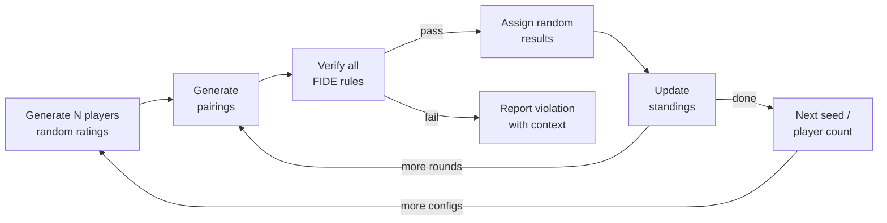
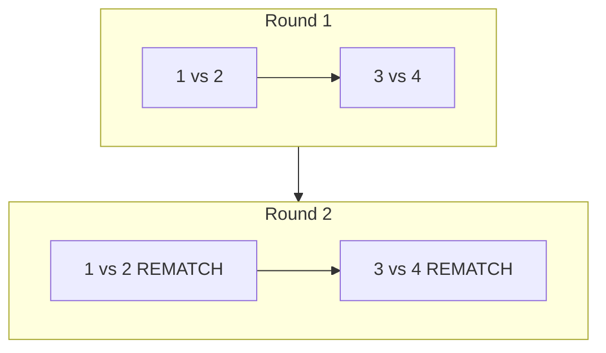
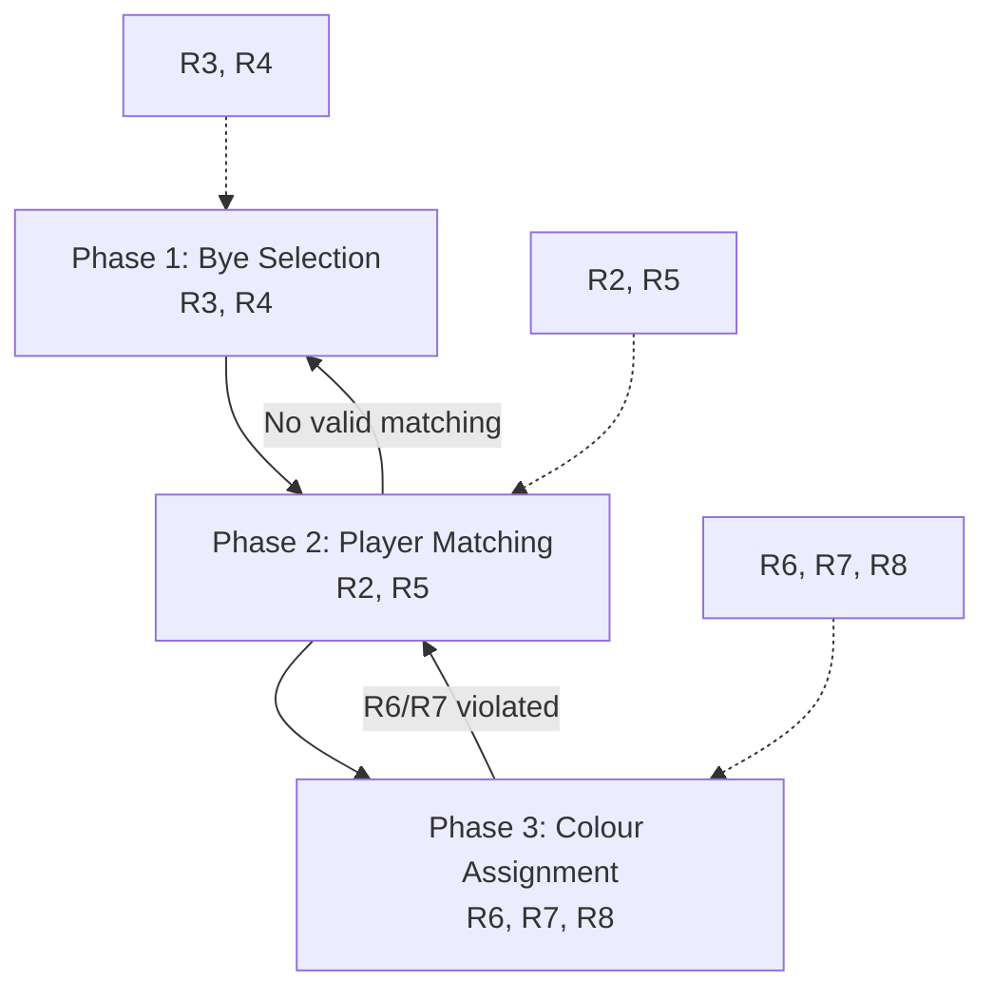
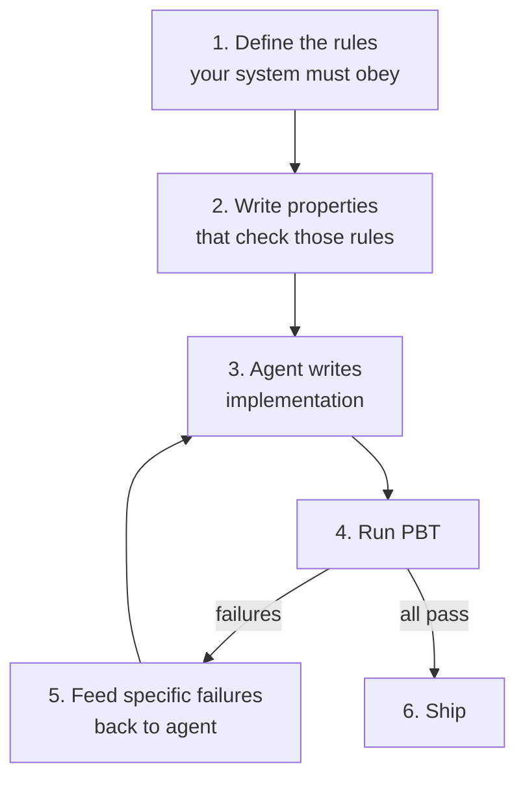

---
layout: post
title: "The Importance of Property-Based Testing in the Vibe Coding Era"
date: 2026-03-17
categories: ["testing", "property-based-testing", "ai", "vibe-coding", "android"]
---

## Why we need better verification for AI-generated code

Most of the code I write these days starts with a prompt. That's true for a lot of engineers. Coding agents handle everything from boilerplate to full feature implementations, and they're getting better at it fast.

Delegating the responsibility of coding and feature implementation to these agents, calls for a need for thorough verification, that the code output is indeed doing what it is expected to do. When a human writes code, another human reviews it, and the reviewer has a reasonable shot at catching problems because the code was produced at human speed with human reasoning. When an agent produces thousands of lines of code within a short period of time, thorough code review is not realistic.


This will only get worse. As AI agents get better and faster, engineering teams will face more pressure to deliver features faster. The code volume goes up. Careful line-by-line review of agent output will eventually become a bottle neck that will be abandoned.
The creator of Open Claw famously mentioned that he did not read the code for the software.


We need something better. We need a way to verify that code from a non-deterministic source (one that produces different output each time, has no formal proof of correctness) actually does what it's supposed to.

This problem isn't unique to AI. Humans are essentially non-deterministic coding agents. We misread specs, we forget edge cases, we write bugs that pass review and live in production for months. The industry built a whole set of tools to deal with this:

- Linters and rules constrain style and catch surface issues
- Unit tests verify specific input-output pairs
- Integration tests check that components work together

These all apply to agent-generated code. But they leave a gap. Unit tests only cover the cases someone thought to write. Integration tests verify high-level flows, not algorithmic invariants. Neither is good at finding bugs that depend on specific combinations of inputs across accumulated state.

**Property-based testing** fills that gap. You define invariants that should hold for any valid input, then throw hundreds of random inputs at the code and check whether the invariants break. I wrote [an introduction to PBT](https://blog.oziomaogbe.com/python/testing/property-based-testing/hypothesis/kotest/scalacheck/2024/07/17/property-based-testing-in-python.html) previously that covers the fundamentals. 
In this article I will demonstrate how to apply property based testing to verify AI generated code.

**The case study**: A **Chess Tournament scheduling** app that I vibe coded, where PBT caught three classes of bugs that would have been difficult to discover with manual testing.

## Background: The Chess Swiss Tournament Scheduling app

Every chess club hosting a Swiss style tournament, will need a software that can correctly generate pairing for each round according to the [FIDE rules](https://handbook.fide.com/chapter/C0401202507). I have always wanted to build one but have been deterred by the complexity of the scheduling algorithm.

Here are the rules
1. The number of rounds to be played is declared beforehand.

2. Two participants shall not play against each other more than once.

3. Should the number of participants to be paired be odd, one participant is not paired. This participant receives a pairing-allocated bye: no opponent, no colour and as many points as are rewarded for a win, unless the rules of the tournament state otherwise. This number of points shall be the same for all pairing-allocated byes.

4. A participant who has already received a pairing allocated bye, or has already scored in one single round, without playing, as many points as rewarded for a win, shall not receive the pairing allocated bye.

5. In general, participants are paired to others with the same score.

6. For each participant the difference between the number of rounds they play with Black and the number of rounds they play with White shall not be greater than 2 or less than -2. Each pairing system may have exceptions to this rule.

7. No participants shall receive the same colour three times in a row. Each pairing system may have exceptions to this rule.

8. In general, a participant is given the colour with which they played fewer rounds. If colours are already balanced, then, in general, the participant is given the colour that alternates from the last one with which they played.


The rules interact. A valid matching can become impossible to colour-assign. A bye given to one player can leave the rest unmatchable. The constraint graph changes every round based on accumulated history. 

Correctly implementing this kind of scheduling algorithm will take considerable time. Vibe-Coding lowered the implementation barrier. I could describe the problem and have an agent write the implementation. 
The question was whether the implementation would actually be correct.

## Stage 1: Generating the implementation

**The prompt:**

> Build a chess tournament scheduling android application, it should have options for adding players and their fide id and their rating, these players should be used for scheduling the tournaments. The tournament manager should contain both swiss and round robin system.The Swiss system should follow the FIDE rules in this section 
> https://handbook.fide.com/chapter/C0401202507.
>  The UI should be intuitive and easy to use. The database is in sqlite.

The agent produced a complete Android app. Room database, Jetpack Compose UI, navigation, player management, pairing engines for Swiss and Round Robin. The Swiss engine sorted players by score, paired sequentially within score groups, and assigned colours per pair.

The code was clean. Well-structured. Had comments referencing each FIDE rule. If I'd created an 8-player tournament and clicked through a couple of rounds, everything would have looked fine.

## Stage 2: Verifying the Swiss Pairing Algorithm for correctness

After the basic implementation of the app, I needed to verify that indeed, the Swiss pairing manager was implemented according to the defined rules.

There are 2 approaches I could take here, 

 1. **Top Down Approach**: Go through every line of code to understand the implementation. Maybe some formal proof method, to verify that the implementation will work out for edge case scenarios.
 2. **Bottom Up Approach**:  Instead of reviewing the code, line by line, write out automated tests, that defines strict conditions that your code must pass, and run the implementation through your tests to verify the functionality. This lowers the surface to be reviewed, instead of reviewing the whole implementation, you only need to review the test.
 
> Note that this is not a one size fit all recommendation, many systems, like financial software might still require very thorough code review verification.

For the swiss manager app, I will use **property based testing** to implement the second approach. 
Instead of individual test cases, we will define the set of rules/invariants that that must not break for each of the pairing rounds. 
And simulate hundreds of combination of inputs through the manager, and if the rules do not break, the system works correctly.

Defining the invariants for this app is simple, because the rules are clearly stated in the requirements.

**The prompt:**

> Also can you add simulation property based testing to ensure that the Fide rules are enforced for swiss?
>
> The following rules are valid for each Swiss system unless explicitly stated otherwise:
> 1. The number of rounds to be played is declared beforehand.
> 2. Two participants shall not play against each other more than once.
> 3. Should the number of participants to be paired be odd, one participant is not paired...
> 4. A participant who has already received a pairing allocated bye... shall not receive the pairing allocated bye.
> 5. In general, participants are paired to others with the same score.
> 6. For each participant the difference between the number of rounds they play with Black and the number of rounds they play with White shall not be greater than 2 or less than -2.
> 7. No participants shall receive the same colour three times in a row.
> 8. In general, a participant is given the colour with which they played fewer rounds...

I pasted the FIDE rules directly into the prompt. The agent built a test harness that simulates full tournaments with random configurations and checks every rule after every round:



The properties tested after each round:

```kotlin
verifyRule2_NoRematches(allPairings, newPairings, context)
verifyRule3_ByeForOddPlayers(playerCount, newPairings, context)
verifyRule4_NoDoubleByes(allPairings, newPairings, context)
verifyRule6_ColorDifference(allPairings, newPairings, context)
verifyRule7_NoThreeConsecutiveSameColor(allPairings, newPairings, context)
verifyAllPlayersPairedExactlyOnce(standings, newPairings, context)
```

Each verifier is 10-20 lines of straightforward code. Rule 7, for example, just builds the per-player colour sequence ordered by round and scans for three-in-a-row. These are easy to write and easy to read. You can audit the verifiers in a few minutes and be confident they correctly encode the rules.

### Example: Rule 7 Verification Logic

Below is the implementation for verifying that no player receives the same color for three consecutive rounds, as per FIDE Swiss rules.

```kotlin
/**
 * Rule 7: No participant shall receive the same colour three times in a row.
 * * This function aggregates the history of all pairings and scans each player's 
 * color sequence to ensure no 'W' or 'B' appears three times consecutively.
 */
private fun verifyRule7_NoThreeConsecutiveSameColor(
    previousPairings: List<Pairing>,
    newPairings: List<Pairing>,
    context: String
) {
    val allPairings = previousPairings + newPairings

    // Build per-player color history in chronological round order
    val colorHistory = mutableMapOf<Long, MutableList<Char>>()
    val sortedPairings = allPairings
        .filter { it.blackPlayerId != null } // Only rounds where colors are assigned
        .sortedBy { it.roundNumber }

    for (pairing in sortedPairings) {
        // Record White player color
        colorHistory.getOrPut(pairing.whitePlayerId) { mutableListOf() }.add('W')
        
        // Record Black player color
        val blackId = pairing.blackPlayerId ?: continue
        colorHistory.getOrPut(blackId) { mutableListOf() }.add('B')
    }

    // Validate the sequence for every player
    for ((playerId, history) in colorHistory) {
        if (history.size < 3) continue // Not enough rounds to violate Rule 7

        for (i in 2 until history.size) {
            val current = history[i]
            val prev = history[i - 1]
            val secondPrev = history[i - 2]

            if (current == prev && current == secondPrev) {
                fail(
                    """
                    RULE 7 VIOLATED: Player $playerId assigned '$current' 3x in a row.
                    Sequence: ${history.joinToString(" -> ")}
                    Context: $context
                    """.trimIndent()
                )
            }
        }
    }
}
```
That's the key thing about this approach. I can't easily verify a 300-line backtracking algorithm is correct. I can verify that a 15-line rule checker is correct. PBT lets you shift verification effort from the hard thing (the algorithm) to the easy thing (the rules).

After running the test suite, some of the test failed, with the following invariants broken.

##  Rematches (Rule 2)

The most basic property broke first. No rematches.

```
RULE 2 VIOLATED: Rematch between players 3 and 1
[seed=2, players=4, round=2/2]
```

With 4 players over 2 rounds, the greedy approach paired the same players again because it never checked history.



This is not easy to catch with manual testing. With 8+ players, rematches don't happen in the first few rounds. The bug only shows up with small player pools over multiple rounds, which is exactly the kind of scenario PBT generates automatically across 50 different random seeds.

## Colour assignment (Rules 6 and 7)

The engine assigned colours pair-by-pair: for each match, pick whichever assignment best satisfies R8 (colour balancing). This works locally, but failed globally.

```
RULE 7 VIOLATED: Player 5 has three consecutive 'B' colors: W, B, B, B
[seed=24, players=8, round=5/5]
RULE 6 VIOLATED: Player 3 has color difference 3 (white=4, black=1)
[seed=7, players=6, round=3/3]
```


##  Bye-matching interaction (Rule 4)

Last set of failures. The bye selection interacted badly with matching feasibility.

```
RULE 4 VIOLATED: Player 2 received a second bye while eligible players exist
[seed=1, players=5, round=4/4]
STRUCTURAL VIOLATION: Not all players paired exactly once. Missing: {3}
[seed=3, players=5, round=3/3]
```

Two problems:

1. Bye priority was sorting by score first, then checking for previous byes. Should be the opposite: deprioritize previous bye receivers first.
2. The engine committed to a bye candidate without checking if the remaining players could actually be matched. If matching failed, it gave up instead of trying the next candidate.


Finally I prompted the agent to continue iterate on the implementation based on these tests until it passed. 

## What the final architecture looks like

None of this was planned upfront. The agent's first attempt was a single-pass greedy algorithm. The three-phase backtracking architecture was shaped entirely by PBT failures:



The final test suite covers over 700 simulated tournaments across player counts from 3 to 32, with varied result distributions (random, all draws, all decisive, white always wins). Six rule checks run after every round, totaling roughly 12,000 individual property verifications.

## The bottom-up vibe coding workflow

Integrating **property based testing** in my vibe coding workflow has helped me ship code with more confidence that it is not breaking my system. 
I have [integrated this pattern](https://github.com/Oziomajnr/PgnToGif/blob/main/chesscore/src/test/kotlin/com/chunkymonkey/chesscore/ChessCorePropertyTest.kt) in other of my applications like the [Chess to GIF generator](https://play.google.com/store/apps/details?id=com.chunkymonkey.imagetogifconverter)



**Step 1:** Define what correct means. For Swiss pairing, that's FIDE rules. For a payments system, it's accounting invariants. For a protocol, it's the RFC.

**Step 2:** Write properties that check those definitions. The properties are simple code. A 15-line function that checks "no player has the same colour three times in a row" is easy to verify by hand. You focus your review effort here, not on the 300-line algorithm.

**Step 3:** Let the agent generate the implementation. Don't spend time reading it.

**Step 4:** Run the property tests. When they fail, they produce concrete counterexamples: specific player count, specific seed, specific round, specific rule violated.

**Step 5:** Feed the failures back to the agent. The counterexamples are exactly the kind of input an agent can act on. "Rule 7 violated for Player 5, seed 24, round 5" tells the agent what's wrong without requiring it to reason abstractly about its own algorithm.

Step 6: Repeat until all properties pass. Each fix might break other properties, but the test suite holds ground. Previously passing tests don't regress. In this project, three iterations got us from a broken greedy algorithm to a correct three-phase backtracking solver.

## Where PBT fits among other verification tools

| Mechanism | Good at | Bad at |
|-----------|---------|--------|
| Linters/rules | Style, deprecated APIs | Algorithmic correctness |
| Unit tests | Known specific cases | Cases you didn't think of |
| Integration tests | System-level data flow | Constraint interactions |
| Property-based tests | Invariant violations across random inputs | Subjective quality, UI/UX |

PBT works well when:
- Correctness criteria are defined formally (regulations, specs, mathematical rules)
- Output is easier to verify than to compute (checking "no rematches" is trivial; generating valid pairings is hard)
- Bugs depend on accumulated state across operations

It doesn't help much when correctness is subjective or when the output is as hard to verify as it is to produce.


---

For PBT basics (input generation, shrinking, common property patterns), see: [An Introduction to Property-Based Testing](https://blog.oziomaogbe.com/python/testing/property-based-testing/hypothesis/kotest/scalacheck/2024/07/17/property-based-testing-in-python.html)*

[The Chess Tournament Manager app is on Google Play](https://play.google.com/store/apps/details?id=com.chunkymonkey.chess.tournament). 

The source code is available on  [GitHub](https://github.com/Oziomajnr/ChessTournamentManager), if anyone cares to read :)
