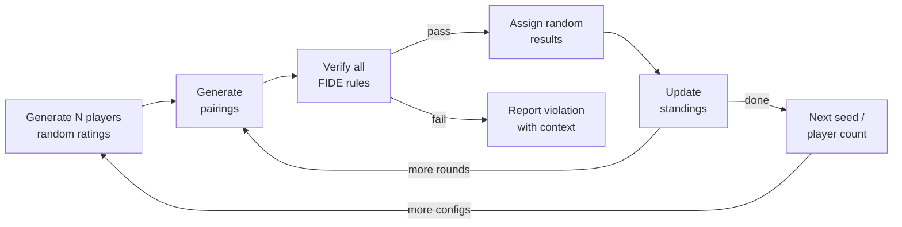
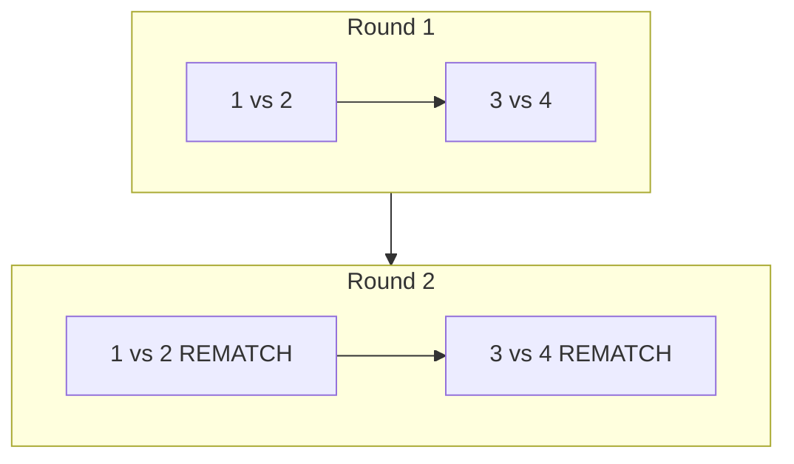
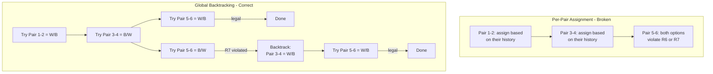
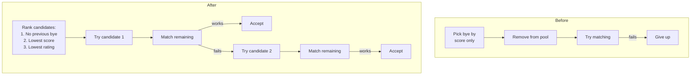
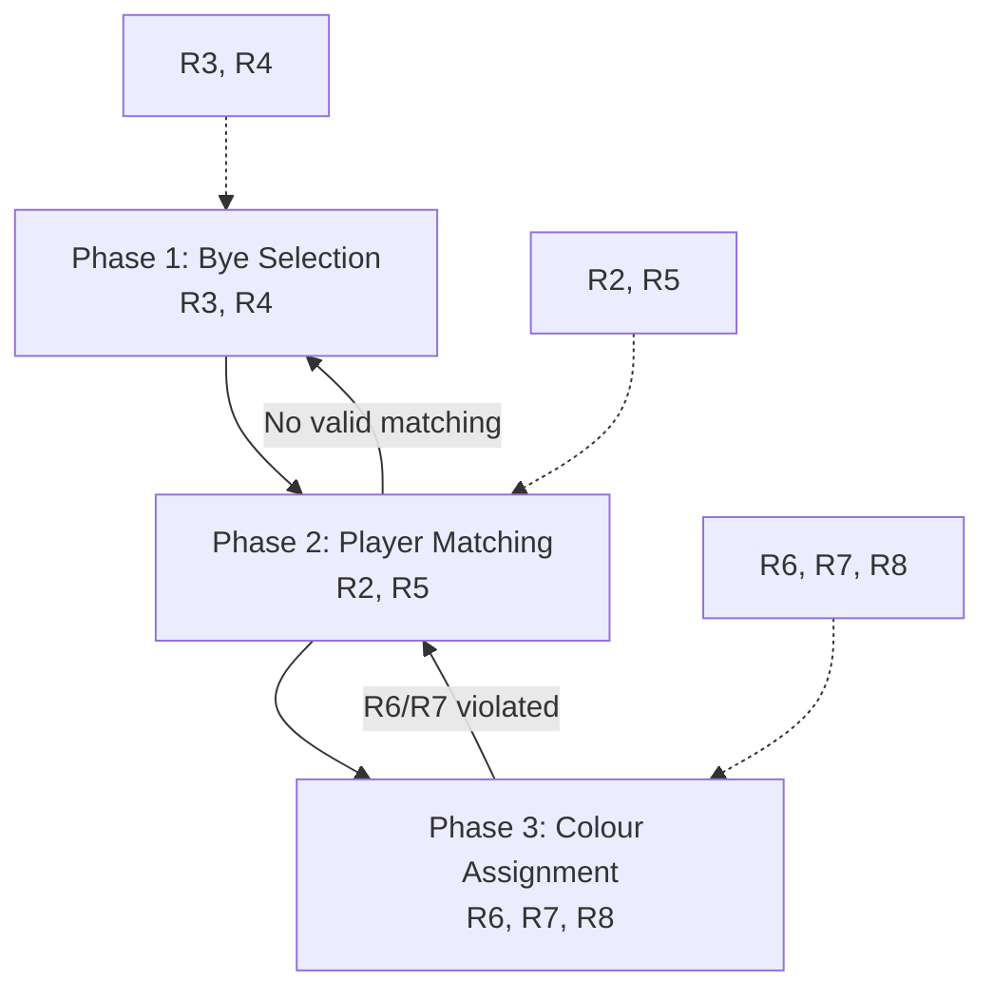
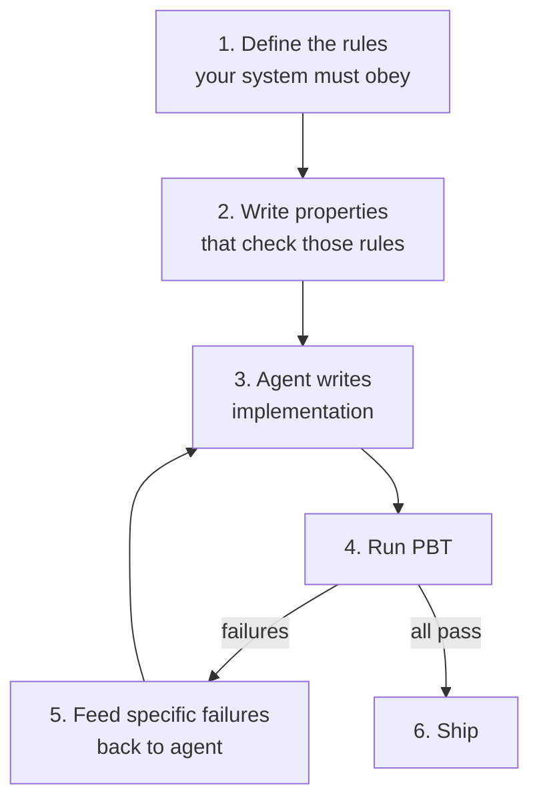

## Why we need better verification for AI-generated code

Most of the code I write these days starts with a prompt. That's true for a lot of engineers now. Coding agents handle everything from boilerplate to full feature implementations, and they're getting better at it fast.

The thing nobody talks about enough is what this does to code review. When a human writes code, another human reviews it, and the reviewer has a reasonable shot at catching problems because the code was produced at human speed with human reasoning. When an agent produces 2,000 lines of Kotlin in 90 seconds, the reviewer is just skimming. They check that the structure looks reasonable, the names make sense, and move on. That's not really review. It's pattern matching on vibes.

This will only get worse. The efficiency pressure on engineering teams goes in one direction. The agents get faster. The code volume goes up. Careful line-by-line review of agent output will eventually be abandoned because it's too slow relative to the speed at which agents produce code.

We need something better. We need a way to verify that code from a non-deterministic source (one that produces different output each time, has no formal proof of correctness, and confidently generates plausible-looking code regardless of whether it's right) actually does what it's supposed to.

This problem isn't unique to AI. Humans are non-deterministic coding agents too. We misread specs, we forget edge cases, we write bugs that pass review and live in production for months. The industry built a whole set of tools to deal with this:

- Linters and rules constrain style and catch surface issues
- Unit tests verify specific input-output pairs
- Integration tests check that components work together

These all apply to agent-generated code. But they leave a gap. Unit tests only cover the cases someone thought to write. Integration tests verify high-level flows, not algorithmic invariants. Neither is good at finding bugs that depend on specific combinations of inputs across accumulated state.

Property-based testing fills that gap. You define invariants that should hold for any valid input, then throw hundreds of random inputs at the code and check whether the invariants break. I wrote [an introduction to PBT](https://blog.oziomaogbe.com/python/testing/property-based-testing/hypothesis/kotest/scalacheck/2024/07/17/property-based-testing-in-python.html) previously that covers the fundamentals. This article is about what happens when you apply PBT to AI-generated algorithmic code in practice.

The case study: a chess tournament scheduling app that I vibe coded, where PBT caught three classes of bugs that neither code review nor manual testing would have found.

## Background: the algorithm I didn't want to write

I'd been wanting to build a chess tournament manager for years. I play in local tournaments, I've helped organize a few, and the existing tools are mostly old desktop apps. A mobile app with offline storage and a clean UI would be useful.

I never built it because of the pairing algorithm. Swiss-system pairing, done properly per FIDE regulations (handbook section C.04.1), is a constraint satisfaction problem with eight interacting rules:

| Rule | What it says | Hard/Soft |
|------|-------------|-----------|
| R2 | No rematches | Hard |
| R3 | Odd player count means exactly one bye | Hard |
| R4 | No double byes | Hard |
| R5 | Pair players with similar scores | Soft |
| R6 | \|whites - blacks\| ≤ 2 per player | Hard |
| R7 | No same colour three times in a row | Hard |
| R8 | Give the colour played fewer; if balanced, alternate | Soft |

The rules interact. A valid matching can become impossible to colour-assign. A bye given to one player can leave the rest unmatchable. The constraint graph changes every round based on accumulated history. Not the kind of thing I wanted to work through on a weekend.

Vibe coding changed the calculus. I could describe the problem and have an agent write the implementation. The question was whether the implementation would actually be correct.

## Stage 1: Generating the implementation

**The prompt:**

> Build a chess tournament scheduling android application, it should have options for adding players and their fide id and their rating, these players should be used for scheduling the tournaments. The tournament manager should contain both swiss and round robin system. The UI should be intuitive and easy to use. The database is in sqlite.

The agent produced a complete Android app. Room database, Jetpack Compose UI, navigation, player management, pairing engines for Swiss and Round Robin. The Swiss engine sorted players by score, paired sequentially within score groups, and assigned colours per pair.

The code was clean. Well-structured. Had comments referencing each FIDE rule. If I'd created an 8-player tournament and clicked through a couple of rounds, everything would have looked fine.

## Stage 2: Writing properties instead of reviewing code

Instead of reading through the algorithm trying to decide if it was correct, I asked the agent to write property-based tests against the FIDE rules.

**The prompt:**

> Also can you add simulation property based testing to ensure that the Fide rules are enforced for swiss?
>
> The following rules are valid for each Swiss system unless explicitly stated otherwise:
> 1. The number of rounds to be played is declared beforehand.
> 2. Two participants shall not play against each other more than once.
> 3. Should the number of participants to be paired be odd, one participant is not paired...
> 4. A participant who has already received a pairing allocated bye... shall not receive the pairing allocated bye.
> 5. In general, participants are paired to others with the same score.
> 6. For each participant the difference between the number of rounds they play with Black and the number of rounds they play with White shall not be greater than 2 or less than -2.
> 7. No participants shall receive the same colour three times in a row.
> 8. In general, a participant is given the colour with which they played fewer rounds...

I pasted the FIDE rules directly into the prompt. The agent built a test harness that simulates full tournaments with random configurations and checks every rule after every round:



The properties tested after each round:

```kotlin
verifyRule2_NoRematches(allPairings, newPairings, context)
verifyRule3_ByeForOddPlayers(playerCount, newPairings, context)
verifyRule4_NoDoubleByes(allPairings, newPairings, context)
verifyRule6_ColorDifference(allPairings, newPairings, context)
verifyRule7_NoThreeConsecutiveSameColor(allPairings, newPairings, context)
verifyAllPlayersPairedExactlyOnce(standings, newPairings, context)
```

Each verifier is 10-20 lines of straightforward code. Rule 7, for example, just builds the per-player colour sequence ordered by round and scans for three-in-a-row. These are easy to write and easy to read. You can audit the verifiers in a few minutes and be confident they correctly encode the rules.

That's the key thing about this approach. I can't easily verify a 300-line backtracking algorithm is correct. I can verify that a 15-line rule checker is correct. PBT lets you shift verification effort from the hard thing (the algorithm) to the easy thing (the rules).

First test run: most of the 17 tests failed.

## Stage 3: Rematches (Rule 2)

The most basic property broke first. No rematches.

```
RULE 2 VIOLATED: Rematch between players 3 and 1
[seed=2, players=4, round=2/2]
```

With 4 players over 2 rounds, the greedy approach paired the same players again because it never checked history.



You wouldn't catch this in manual testing. With 8+ players, rematches don't happen in the first few rounds. The bug only shows up with small player pools over multiple rounds, which is exactly the kind of scenario PBT generates automatically across 50 different random seeds.

**Fix:** Replace greedy matching with backtracking. Maintain a set of previous matchups. Try opponents in score-proximity order, backtrack on dead ends.

Rule 2 violations gone. Other rules still failing.

## Stage 4: Colour assignment (Rules 6 and 7)

The next set of failures was more interesting. The engine assigned colours pair-by-pair: for each match, pick whichever assignment best satisfies R8 (colour balancing). Locally reasonable. Globally broken.

```
RULE 7 VIOLATED: Player 5 has three consecutive 'B' colors: W, B, B, B
[seed=24, players=8, round=5/5]
RULE 6 VIOLATED: Player 3 has color difference 3 (white=4, black=1)
[seed=7, players=6, round=3/3]
```

The issue: if you assign colours to pairs 1-2 and 3-4 independently, you can paint yourself into a corner where pair 5-6 has no legal colour assignment.



This is a good example of why code review fails for this kind of problem. Each individual colour decision in the agent's code was reasonable. The bug is in the interaction between decisions across the full set of pairs, which only surfaces in specific multi-round scenarios with specific colour history combinations. No human reviewer would catch this by reading the code. PBT caught it by simulating hundreds of tournaments.

**Fix:** Separate colour assignment into a distinct phase that considers all pairs at once using backtracking:

```kotlin
fun solve(index: Int): Boolean {
    if (index == pairs.size) return true
    val (a, b) = pairs[index]
    for ((white, black) in orderedColorOptions(a, b, ...)) {
        if (!isColorLegal(white, 'W', ...) ||
            !isColorLegal(black, 'B', ...)) continue
        applyColor(white, 'W', ...)
        applyColor(black, 'B', ...)
        if (solve(index + 1)) return true
        undoColor(white, 'W', ...)
        undoColor(black, 'B', ...)
    }
    return false
}
```

R8 guides the search order (try the preferred assignment first). R6 and R7 prune illegal branches.

## Stage 5: Bye-matching interaction (Rule 4)

Last set of failures. The bye selection interacted badly with matching feasibility.

```
RULE 4 VIOLATED: Player 2 received a second bye while eligible players exist
[seed=1, players=5, round=4/4]
STRUCTURAL VIOLATION: Not all players paired exactly once. Missing: {3}
[seed=3, players=5, round=3/3]
```

Two problems:

1. Bye priority was sorting by score first, then checking for previous byes. Should be the opposite: deprioritize previous bye receivers first.
2. The engine committed to a bye candidate without checking if the remaining players could actually be matched. If matching failed, it gave up instead of trying the next candidate.



**Fix:** Try bye candidates in order. For each, attempt a complete matching of the rest. Only commit if matching succeeds. Also added a three-level fallback:

| Level | Constraints | When used |
|-------|-----------|-----------|
| 1 | No rematches + colour-feasible pairs | Default |
| 2 | No rematches, skip colour check | Level 1 fails |
| 3 | Allow rematches | Last resort |

After this fix, all 17 tests passed across all seeds.

## What the final architecture looks like

None of this was planned upfront. The agent's first attempt was a single-pass greedy algorithm. The three-phase backtracking architecture was shaped entirely by PBT failures:



The final test suite covers over 700 simulated tournaments across player counts from 3 to 32, with varied result distributions (random, all draws, all decisive, white always wins). Six rule checks run after every round, totaling roughly 12,000 individual property verifications.

## The bottom-up vibe coding workflow

The common vibe coding workflow is top-down: describe, generate, review, ship. Review is supposed to be the safety net. For complex algorithmic code, it's a weak one.

The approach I'm describing is bottom-up:



Step 1: Define what correct means. For Swiss pairing, that's FIDE rules. For a payments system, it's accounting invariants. For a protocol, it's the RFC.

Step 2: Write properties that check those definitions. The properties are simple code. A 15-line function that checks "no player has the same colour three times in a row" is easy to verify by hand. You focus your review effort here, not on the 300-line algorithm.

Step 3: Let the agent generate the implementation. Don't spend time reading it.

Step 4: Run the property tests. When they fail, they produce concrete counterexamples: specific player count, specific seed, specific round, specific rule violated.

Step 5: Feed the failures back to the agent. The counterexamples are exactly the kind of input an agent can act on. "Rule 7 violated for Player 5, seed 24, round 5" tells the agent what's wrong without requiring it to reason abstractly about its own algorithm.

Step 6: Repeat until all properties pass. Each fix might break other properties, but the test suite holds ground. Previously passing tests don't regress. In this project, three iterations got us from a broken greedy algorithm to a correct three-phase backtracking solver.

## Where PBT fits among other verification tools

| Mechanism | Good at | Bad at |
|-----------|---------|--------|
| Linters/rules | Style, deprecated APIs | Algorithmic correctness |
| Unit tests | Known specific cases | Cases you didn't think of |
| Integration tests | System-level data flow | Constraint interactions |
| Property-based tests | Invariant violations across random inputs | Subjective quality, UI/UX |

PBT works well when:
- Correctness criteria are defined formally (regulations, specs, mathematical rules)
- Output is easier to verify than to compute (checking "no rematches" is trivial; generating valid pairings is hard)
- Bugs depend on accumulated state across operations

It doesn't help much when correctness is subjective or when the output is as hard to verify as it is to produce.

## Takeaway

I sat on this app for years because I didn't want to implement the scheduling algorithm. Vibe coding got me an implementation in minutes. The implementation was wrong in three ways that code review wouldn't have caught. PBT found all three by running hundreds of random tournament simulations against the FIDE rules.

The pattern generalizes. When you're working with agent-generated code, don't put all your trust in reading it. Define what correct behavior looks like. Encode it as properties. Let the test suite do the verification at a scale no human reviewer can match. When tests fail, hand the counterexamples back to the agent and let it iterate.

Write the spec. Let the agent write the code. Let the tests decide if it's right.

---

*For PBT basics (input generation, shrinking, common property patterns), see: [An Introduction to Property-Based Testing](https://blog.oziomaogbe.com/python/testing/property-based-testing/hypothesis/kotest/scalacheck/2024/07/17/property-based-testing-in-python.html)*

*The Chess Tournament Manager app is on [Google Play](https://play.google.com). The Swiss pairing engine and property-based tests referenced here are in the project source.*
